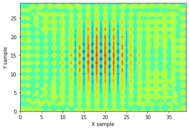

# FDTD Sound Field Analysis

**有限差分時間領域法による音場解析 / Sound Field Analysis using Finite-Difference Time-Domain Method**

---

## 概要 / Overview

**日本語**

有限差分時間領域法（FDTD法）を用いた2次元音場シミュレーションです。
境界条件にコンクリートのインピーダンスを設定しており、壁面での音波反射による干渉縞を可視化しています。
シンプルな実装を心がけており、音響工学を学ぶ方の参考になることを目的としています。

**English**

This is a 2D sound field simulation using the Finite-Difference Time-Domain (FDTD) method.
The boundary condition is set to concrete impedance, visualizing the interference pattern caused by sound wave reflections from walls.
The code is intentionally kept simple and readable, making it ideal for those learning acoustics and numerical simulation.

---

## 特徴 / Features

- シンプルで読みやすいコード / Simple and readable code
- 物理の式がそのままコードに反映 / Physics equations directly mapped to code
- コンクリートのインピーダンス境界条件 / Concrete impedance boundary conditions
- NumPyベクトル演算による効率的な実装 / Efficient implementation using NumPy vectorization
- 音場の可視化（カラーマップ）/ Sound field visualization (colormap)

---

## 必要環境 / Requirements

```
Python 3.x
numpy
scipy
matplotlib
```

---

## 使い方 / Usage

```bash
python fdtdf.py
```

---

## パラメータ / Parameters

| パラメータ | 値 | 説明 |
|---|---|---|
| `f` | 1000 Hz | 周波数 / Frequency |
| `C` | 343 m/s | 音速 / Speed of sound |
| `ro` | 1.21 kg/m³ | 空気密度 / Air density |
| `ro1` | 2.3 kg/m³ | コンクリート密度 / Concrete density |
| `Z` | ro1 × C | 境界インピーダンス / Boundary impedance (concrete) |
| `N` | 5000 | タイムステップ数 / Number of time steps |
| `X`, `Y` | 40, 30 | グリッドサイズ / Grid size |

---

## 結果例 / Result Example

音源は `P[20,15]`（グリッド中央付近）に配置。コンクリート壁での反射による干渉縞が観察できます。

The sound source is placed at `P[20,15]` (near the center of the grid). Interference fringes due to reflections from concrete walls are clearly visible.



---

## 参考 / References

- 日本建築学会編，はじめての音響数値シミュレーションプログラミングガイド,　コロナ社,　(2017)
- 橋本修, 阿部琢美, FDTD時間領域差分法入門, 森北出版, (2010)
---

## 作者 / Author

**Dr. H. Yamazaki**
June 7th, 2020

---

## ライセンス / License

MIT License
